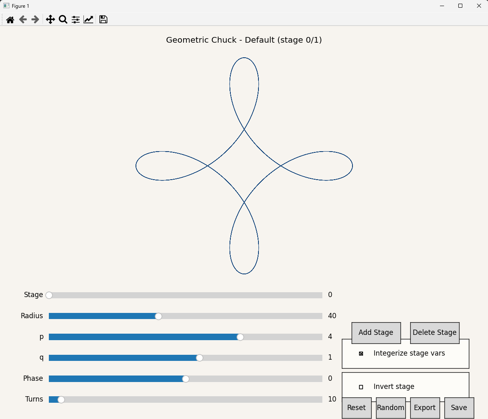

# Geometric Chuck (Python)

A small Python app that simulates a geometric chuck with multiple gear stages and draws the resulting output path.

This app is intended to simulate the Geometric Chuck function in the LatheEngraver Rose Engine plugin.
https://github.com/paukstelis/OctoPrint-LatheEngraver

The settings can be saved to a file 'saved_geos.json' in the same directory as the app. This file can be moved to the 'uploads\rosette' directory of the LatheEngraver(LE) and subsequently loaded into LE. Be careful to back up your current saved_geos.json file before doing this or you will overwrite it!

## What this app does

- Models a chain of gear stages with:
  - Radius
  - p
  - q
  - phase
- Samples points over many rotations
- Plots the resulting curve with Matplotlib
- Optionally saves output to PNG/SVG/PDF
- Includes an interactive slider UI for live stage tuning

## Quick start

1. Create and activate a virtual environment (recommended).
2. Install dependencies:

```bash
pip install -r requirements.txt
```

3. Run:

```bash
python app.py
```

Interactive controls include:

- Stage selector
- Add stage button (duplicates the currently selected stage)
- Delete stage button
- Randomize button (randomizes all stages for the current stage count)
- Export button (appends current settings to `saved_geos.json`)
- SVG button (exports the current drawing to `output/Default_interactive.svg`)
- Radius, p, q, and phase sliders for the selected stage
- Integerize checkbox (forces Radius, p, q, and phase to integer values)
- Invert stage checkbox (flips the selected stage direction)
- Turns slider (changes path length)
- Reset and Save buttons